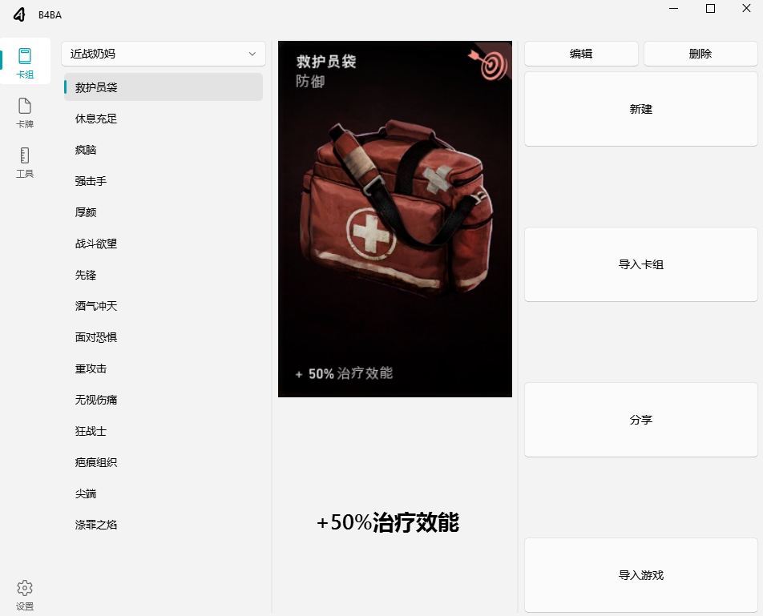
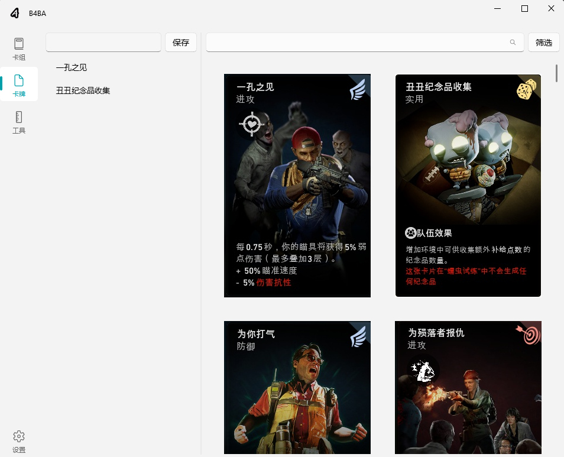

# B4B-Assistant

English | [简体中文](README.md)

B4B Assistant is a deck management tool for BACK 4 BLOOD game. It helps players easily import, export, and manage their game decks.

## Main Features

* 📋 Import decks from clipboard
* 📷 Import decks via OCR scanning
* 💾 Save and manage custom decks
* 🎮 One-click deck import to game
* 📤 Deck sharing functionality (supports exporting share text)

## Usage Instructions

1. Set the game to Borderless Window mode
2. Open the deck interface in game
3. Click the "Import to Game" button in the software
4. Wait for OCR recognition to complete (may take a few seconds)

Note: OCR recognition might take some time, please be patient.

## Build Instructions

If you want to compile the project yourself:

1. Run `deploy.py` file to automatically compile using nuitka
2. To generate localization files, run `translate.py` to export ts files

For developers: Please use `self.tr()` for strings that need localization in the code.

## Acknowledgments

This project uses the following open-source projects:

* [PyQt-Fluent-Widgets](https://github.com/zhiyiYo/PyQt-Fluent-Widgets) - Beautiful Fluent Design style PyQt components
* [RapidOCR](https://github.com/RapidAI/RapidOCR) - Efficient OCR recognition engine

## Screenshots

## Update Log

### v0.1.0 (2025-01)
* ✨ Initial release
* 🎮 Support clipboard deck import
* 📷 Support OCR scanning deck import
* 💾 Support saving and managing custom decks
* 🎮 Support one-click deck import to game
* 📤 Support deck sharing functionality (with share text export)
